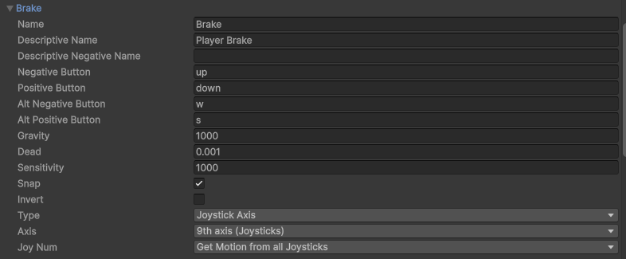

# ProVoice: Designing Proactive Functionality for In-Vehicle Conversational Assistants using Multi-Objective Bayesian Optimization to Enhance Driver Experience

## About

This Unity asset extends on Pascal Jansen's and Mark Colley's [Bayesian Optimization for Unity](https://github.com/Pascal-Jansen/Bayesian-Optimization-for-Unity) and Unity's [Automotive Human-Machine Interaction Template](https://assetstore.unity.com/packages/templates/automotive-hmi-template-201095), enabling optimization of design parameters for modelling proactive In-Vehicle Conversational Assistant (IVCA) intervention. It advocates a Human-In-The-Loop (HITL) approach, exploring design parameter values based on iterative user feedback (see [QuestionnaireToolkit](https://assetstore.unity.com/packages/tools/gui/questionnairetoolkit-157330)) to maximise/minimise a set of high-level design objectives and find the value sets which lie on the pareto front.

This asset is implemented as part of a MSc Human-Computer Interaction dissertation project, titled: *"Designing Proactive Functionality for In-Vehicle Conversational Assistants using Multi-Objective Bayesian Optimization to Enhance Driver Experience"* by Josh Susak. A video demonstration of ProVoice is found in [Dissertation Demo Video](#dissertation-demo-video). The full dissertation paper is available upon request.

## Installation
To set up the asset on your system, please follow these steps:
- Make sure that python **v3.11.3** or later is installed.
- Clone the repository into a new folder:
```bash
  git clone https://github.com/JSusak/ProVoiceProactiveIntervention
```
- Download and install [Unity Hub](https://unity.com/unity-hub).
- Open Unity Hub and sign-up or login with a Unity account.
- Navigate to and add the project to Unity hub by clicking:
```bash
  Add+ -> Add project from disk
```
- If prompted, install Unity **v6000.0.47f1** or later.

- Once project is loaded into Unity, open the demo scene **ProactiveInterventionDemo** *(Assets/Scenes)*. 
- Obtain the path to your python executable and set python settings in **BOforUnityManager** GameObject, in the scene hierarchy. Further instructions for initialising are found in the [Bayesian Optimization for Unity](https://github.com/Pascal-Jansen/Bayesian-Optimization-for-Unity) asset.

## Configuration

This asset includes four example design parameters: (1) Level of Autonomy (LoA), (2) symbol transparency, (3) alert volume and (4) interior glow.
It also includes three example design objectives: (1) Mental demand, (2) predictability, (3) usefulness.  
A playable interior (see [Automotive HMI Template](https://assetstore.unity.com/packages/templates/automotive-hmi-template-201095?srsltid=AfmBOorrhkZKnRy9vmo-8Ynvgfh3SHoynqYk0Mq6hKrqbAb34urZlisn)) and XR rig (see [XR Origin](https://docs.unity3d.com/6000.1/Documentation/Manual/xr-origin.html)) are included. This interior can move around the scene using driving simulator apparatus, or a standard keyboard/gaming controller. Car movement is provided via the `PlayerCar.cs` script created in a demo scene by [Gley Urban & Pedestrian System](https://gleygames.com/urban-system/).

## How does proactive intervention occur?
Proactive intervention is triggered when the player enters a set of trigger colliders. Colliders were chosen due to the flexibility to adjust their position at any point throughout a driving journey, allowing to explore different areas of activation. See the figure below for an example of the collider approach during a city environment route, where proactive intervention is marked in blue.


Specifically, each trigger collider script is associated with one design parameter from the **BOforUnityManager** GameObject. Each trigger inherits from the **ProactiveTrigger** abstract class. This class includes a set of non-abstract methods:

- `OnTriggerEnter`: Detect when player reaches the collider. Activate the proactive intervention.
- `WaitForIntervention`: Wait for a period of time, defined in ProactiveSettings (see [Adjusting Proactive Settings](#dissertation-demo-video)). During this period, check if player input occurred. 
- `MarkAsIntervened`: Called by inheriting classes upon recording player input (e.g. voice, keyboard press, controller button). Register as intervened, ending the listening period.

In addition, each inheriting collider script can implement the following abstract methods:

- `TriggerIntervention`: What should happen to the design parameter/assigned GameObject properties upon collider entry.
- `OnPlayerIntervention` *(Optional)*: What should happen immediately after player input is recognised.
- `OnInterventionEnd`: What should happen to the design parameter/assigned GameObject properties after proactive intervention is complete, or finished.

Design parameters are exposed using the BODesignParameterValues GameObject. This object contains a reference to the Object Variable Exposer *(Scripts/BayesianOptimization)*, which retrieves all parameter values set in the **BOForUnityManager** GameObject. 

### Adjusting Proactive Settings
The static class **ProactiveSettings** contains a set of **immutable** global variables for adjusting proactive IVCA settings. This class is located in *Assets/Scripts/ProactiveSettings.cs*

The class includes:
- `level`: Adjusts the LoA. Setting to **-1** makes LoA a fourth parameter trained during MOBO. **0-4** fixes the assistant to an assigned LoA for each iteraion. This variable was used to toggle between different experiment conditions (C1: trained and C2: fixed) during the dissertation VR driving simulator study.
- `proactiveListenDuration`: How long the proactive IVCA should stay active and observe for user intervention.

## Porting to your own Project
This section outlines the steps for exporting the asset into your own Unity project. An installation walkthrough video is included.

**TODO: Put Installation Video**

### Converting to Package
1. Select Assets -> Export package.
2. Add all folders to the package by selecting `All`.
3. Click `Export...` and save the Unity package onto your computer.

### Importing to New Project
1. Create or open the second project which you want to import the package into.
2. Select Assets -> Import Package -> Custom Package. Locate the created Unity package. 
3. Make sure everything is selected by selecting `All`, and click `Import...`.
4. Install `XR Interaction Toolkit` and `XR Hands` from the Unity registry. In `XR Hands`, install `Gestures` and `HandVisualizer`.
5. In Project Settings (Edit -> Project Settings), open Input Manager and add the `Acceleration` and `Brake` input axes to add player movement, as pictured below.


6. *(Optional)* Open the IVI and Cluster scenes in UnityTechnologies -> HMITemplate -> Scenes. Once opened, go into File -> Build Profile and add them to the scene list.
7. Click play to begin the demo scene.

## Adding Custom Intervention Design
You can extend this asset by adding your own custom design parameters and GameObjects to model proactive IVCA intervention design using MOBO.

1. go to the **BOForUnityManager** GameObject and create a new design parameter. Assign a variable name, lower bound, upper bound. In addition, change the number of steps and toggle if the parameter is discrete or continuous. *(Game Object Name and Script Name can be kept unchanged, unless you prefer to store the parameter value in a separate GameObject)*. See more instructions for setting design parameter values in the [Bayesian Optimization for Unity](https://github.com/Pascal-Jansen/Bayesian-Optimization-for-Unity) plugin.

2. Create a GameObject in the scene hierarchy, to adjust according to your newly created design parameter value. This could represent a design element of your choice (see provided examples including Dashboard Intervention Symbol Sprite or Interior Lighting Strip).

3. Create a collider of your choice (sphere recommended). In this collider, set isTrigger to true, set radius to your preference and place on the scene at a desired point in the driving journey.

4. Create a new monoscript in *Assets/Script/Proactivity/InterventionTriggers*. Attach this script to the newly created collider. Change the superclass from MonoBehaviour to ProactiveTrigger and add skeleton functions for abstract methods `TriggerIntervention` and `OnInterventionEnd`. Add a 

### Irrespective of LoA 

See `ProactiveSymbolTriggerDemo.cs` *(Scripts/Proactivity/ProactiveTriggers)* for an example of a design element with fixed behaviour, irrespective of current LoA. This script modifies interior symbol transparency based on the colorA design parameter value.

### Dependent on LoA (i.e. each LoA might produce a different output)

See `ProactiveVoiceTriggerDemo.cs` *(Scripts/Proactivity/ProactiveTriggers)* for an example of a design element with variation between each LoA by implementing switch cases. This is useful if you want to define different outputs depending on the current assigned level.

## Example Demo
This section explains the asset with a step-by-step walkthrough of the demo scene. This assumes that you have opened the demo scene **ProactiveInterventionDemo**, and have set python settings accordingly.

While designed to be used with a compatible Virtual Reality (VR) headset with OpenXR and driving apparatus, the demo scene is fully functional with a desktop display and controls including keyboard, mouse or gaming controller.

1. Press the play button (⏵) at the top centre of the screen.
2. Switch to the game view.
3. You will be greeted with a short introduction screen. Press the 'Begin' button to start.
4. After loading, press the 'Next' button to proceed.
5. You will be located within the vehicle's driving interior. Press the respective forward button on your controls to begin moving the vehicle. *If no VR HMD is connected, the camera will remain in a static position.*
6. After driving forward, the vehicle will enter the sphere collider and activate proactive intervention. See [How does proactive intervention occur?](#how-does-proactive-intervention-occur?) for further details on the implementation.
7. After reaching the goal collider, marked in yellow, a questionnaire will appear, covering the driver's dashboard. Use a VR controller, or computer mouse, to answer the corresponding questions.
8. Click 'Next' to begin a new iteration. The new iteration will begin automatically.

*Iterations can be terminated early, through the 'End Simulation' button to trigger the questionnaire, or 'Restart Iteration' to reload the iteration from the beginning.*


## Dissertation Demo Video

The video below demonstrates the asset being used in ProVoice - a VR driving simulator designed in part fulfillment for a MSc Human-Computer Interaction dissertation project at UCL.

**TODO: Put Prototype Video**

For full access to this scene, feel free to get in touch with the researcher, Josh Susak.

## Contributions
Further contributions are always welcome! Feel free to get in touch with the researcher, Josh Susak. Alternatively, you can:

  - Open issues for bugs or feature requests.
  - Submit pull requests to improve the code.
  - Comment your feedback and ideas.

## Acknowledgements

Many thanks to [Mark Colley](https://github.com/M-Colley) for being a great project supervisor and helping with any concerns, technical or otherwise.

This project also acknowledges use of the following assets, created by other talented developers:

- [Bayesian Optimization for Unity](https://github.com/Pascal-Jansen/Bayesian-Optimization-for-Unity)
- [QuestionnaireToolkit](https://assetstore.unity.com/packages/tools/gui/questionnairetoolkit-157330)
- [Fantastic City Generator](https://assetstore.unity.com/packages/3d/environments/urban/fantastic-city-generator-157625?srsltid=AfmBOorp5wDYJQuKsf2XgmPFTfAYKn_-LdFgN9IHa0ZaUwyr13kNxCwc)
- [Gley Urban & Pedestrian System](https://gleygames.com/urban-system/)
- [Automotive HMI Template](https://assetstore.unity.com/packages/templates/automotive-hmi-template-201095?srsltid=AfmBOorrhkZKnRy9vmo-8Ynvgfh3SHoynqYk0Mq6hKrqbAb34urZlisn)
- [Human Character Dummy](https://assetstore.unity.com/packages/3d/characters/humanoids/humans/human-character-dummy-178395?srsltid=AfmBOooc_nppF_FQzacqvBeD4EjNlNYed0lt7VxZmjiSzrIZuvoyUaXX)
